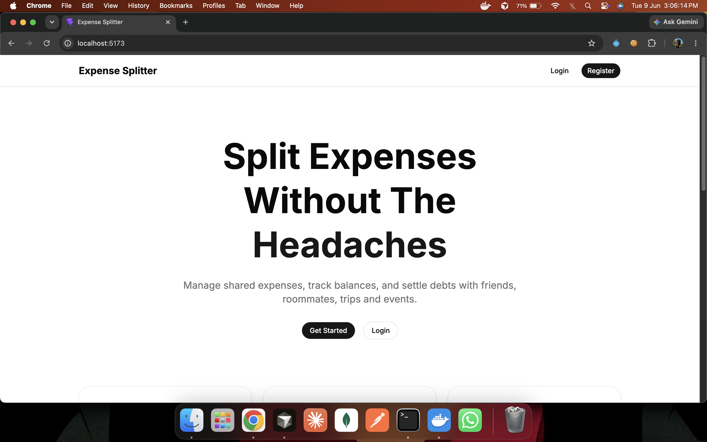
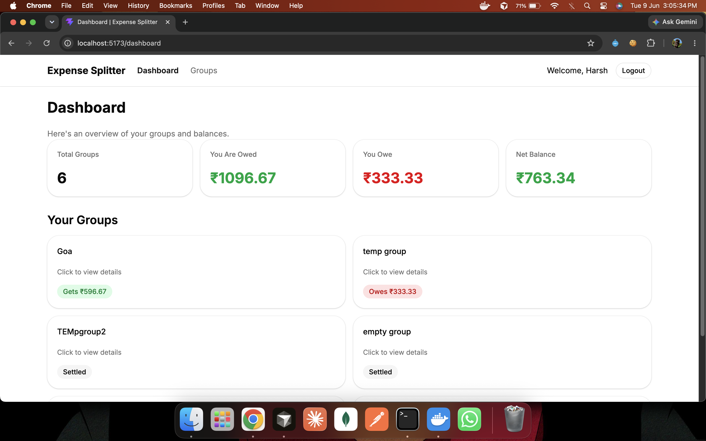
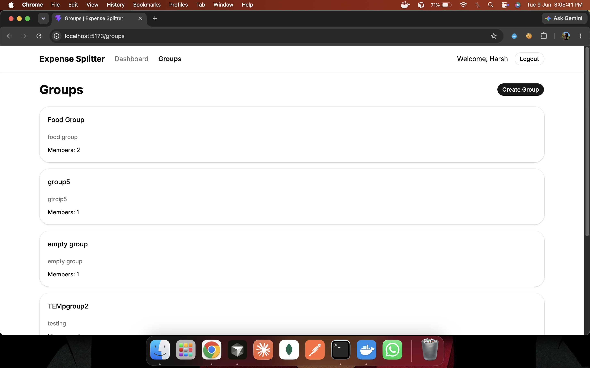
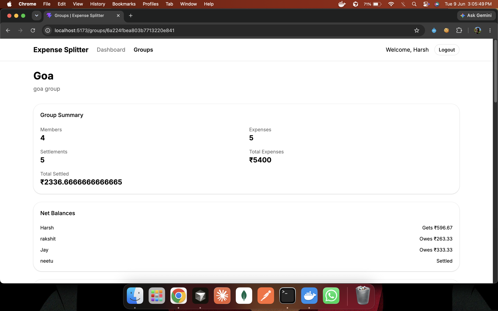
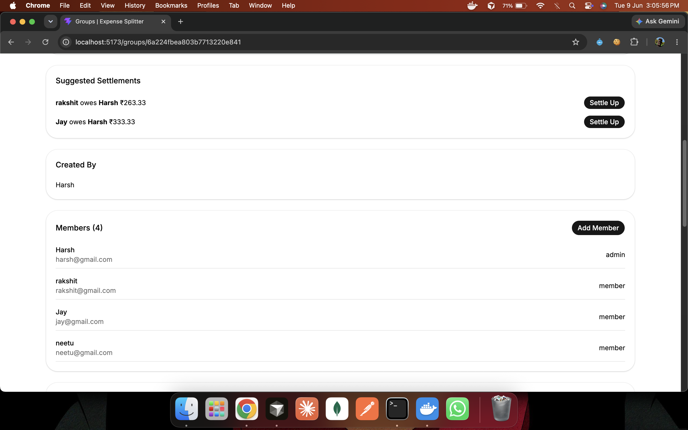
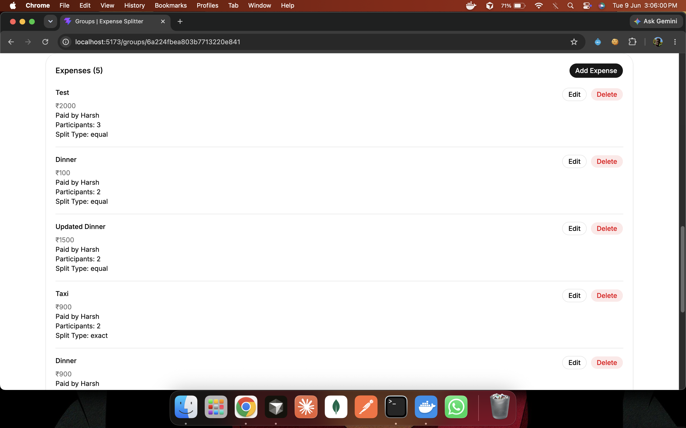
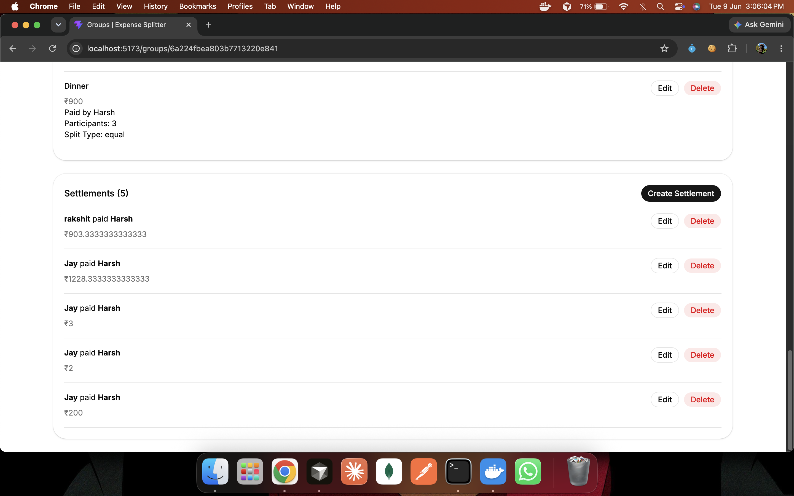

# Expense Splitter

A full-stack expense-sharing application inspired by Splitwise that helps users manage group expenses, track balances, and settle debts efficiently. Built using the MERN stack with Docker support for seamless deployment.

## Live Demo

Frontend:
https://expense-splitter-frontend-two.vercel.app

Backend:
https://expense-splitter-api-lgmg.onrender.com

---

## Features

### Authentication

* User Registration
* User Login
* JWT Authentication
* Refresh Token Rotation
* Session Restoration
* Logout
* Logout from All Devices
* Protected and Public Routes

### Landing Experience

* Modern Landing Page
* Hero Section and Feature Highlights
* Call-to-Action Sections
* Custom 404 Not Found Page

### Dashboard

* Dashboard Overview
* Total Groups Summary
* Amount Owed vs Amount Receivable
* Net Balance Calculation
* Group-wise Balance Overview

### Group Management

* Create Groups
* View All Groups
* Add Members by Mobile Number
* Remove Members
* Leave Groups
* Delete Groups

### Expense Management

* Create Expenses
* View Expenses
* Update Expenses
* Delete Expenses
* Equal Split Support
* Exact Split Support

### Balance Engine

* Calculate Net Balances
* Debt Simplification
* Determine Who Owes Whom
* Suggested Settlements
* Quick Balance Insights

### Settlements

* Create Settlements
* View Settlements
* Update Settlements
* Delete Settlements

### DevOps

* Dockerized Backend
* Dockerized Frontend
* Docker Compose Support
* Environment-Based Configuration
* Production-Ready Build Setup

## Performance Optimizations

- Redis Cache-Aside Pattern
- Event-Driven Cache Invalidation
- Eliminated N+1 MongoDB Queries
- Reduced dashboard warm-up from ~17s to ~186ms
- Reduced repeated dashboard requests to ~23ms

## Screenshots

### Landing Page



### Dashboard



### Groups



### Group Details



### Suggested Settlements 



### Expenses 



### Settlements 




---

## Tech Stack

### Frontend

* React
* Vite
* Tailwind CSS
* shadcn/ui
* Axios
* React Router DOM
* Lucide React

### Backend

* Node.js
* Express.js
* MongoDB Atlas
* Mongoose
* JWT Authentication
* bcryptjs
* Cookie Parser
* Morgan

### DevOps

* Docker
* Docker Compose

---

## Project Structure

```text
expense-splitter/

├── backend/
│   ├── src/
│   │   ├── config/
│   │   ├── controllers/
│   │   ├── middlewares/
│   │   ├── models/
│   │   ├── routes/
│   │   └── utils/
│   ├── Dockerfile
│   ├── .dockerignore
│   └── .env.example
│
├── frontend/
│   ├── src/
│   │   ├── api/
│   │   ├── components/
│   │   ├── context/
│   │   ├── hooks/
│   │   ├── pages/
│   │   ├── routes/
│   │   └── services/
│   ├── Dockerfile
│   ├── .dockerignore
│   └── .env.example
│
├── docker-compose.yml
├── .gitignore
└── README.md
```

---

## Local Development Setup

### Clone Repository

```bash
git clone <repository-url>
cd expense-splitter
```

### Backend Setup

```bash
cd backend
npm install
npm run dev
```

### Frontend Setup

```bash
cd frontend
npm install
npm run dev
```

---

## Docker Setup

Build and run the entire application using Docker Compose:

```bash
docker compose up --build
```

Stop the application:

```bash
docker compose down
```

---

## Environment Variables

### Backend (`backend/.env`)

```env
PORT=
MONGODB_URI=
JWT_SECRET=
ACCESS_TOKEN_EXPIRY=
REFRESH_TOKEN_EXPIRY=
```

### Frontend (`frontend/.env`)

```env
VITE_API_URL=
```

Example:

```env
VITE_API_URL=http://localhost:3000/api
```

---

## API Modules

### Authentication

* Register
* Login
* Refresh Session
* Logout
* Logout From All Devices
* Get Current User

### Groups

* Create Group
* Get Groups
* Get Group Details
* Add Member
* Remove Member
* Leave Group
* Delete Group

### Expenses

* Create Expense
* Get Expenses
* Update Expense
* Delete Expense

### Balances

* Get Group Balances
* Calculate Net Balances
* Suggested Settlements

### Settlements

* Create Settlement
* Get Settlements
* Update Settlement
* Delete Settlement

---

## Future Enhancements

* UPI Integration
* Expense Notifications
* Group Invitations
* Real-Time Updates
* Recurring Expenses
* AWS EC2 Deployment
* Custom Domain and HTTPS

---

## Author

**Harsh Rathore**
